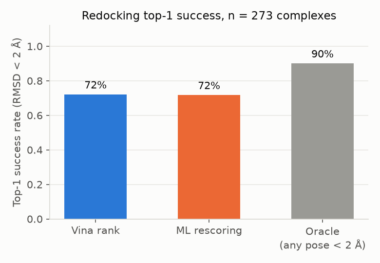
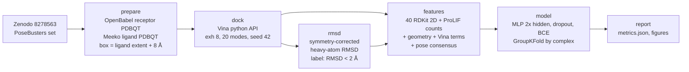

# dock-rescore

Machine-learning rescoring of AutoDock Vina docking poses on the PoseBusters Benchmark set.
Redock each ligand into its own receptor with Vina, then train a small PyTorch MLP on RDKit
ligand descriptors + ProLIF protein-ligand interaction counts + simple geometric features to
re-rank the (up to) 20 Vina poses so that the top-1 pose is near-native (heavy-atom RMSD < 2 Å)
more often than Vina's own ranking.

**Honest headline: on this redocking set the MLP does not beat Vina's own ranking** (top-1 0.718 vs
0.722, 273 complexes). A first version of the model reached 0.788, but the
[scope / leakage audit](#scope-and-leakage-audit-read-before-quoting-the-numbers) showed that the gain
came almost entirely from one feature, the pose-centroid distance to the docking-box centre; because the
box is centred on the crystal ligand, that feature is a near-copy of the RMSD label. It is available in
*redocking* but not in blind or cross-docking, so it is now excluded from the default model
(`model.exclude_features` in `config/config.yaml`) and kept only as an ablation row below.

## Results

**Status: full run on the 308-complex PoseBusters subset (redocking, CPU only).** 308 attempted,
304 docked, 273 scored end to end (see [complex accounting](#complex-accounting-308-to-304-to-273)).
All ML numbers are out-of-fold `GroupKFold(5)` predictions grouped by complex; the MLP is
re-fitted (including feature standardisation) inside every fold.



<!-- RESULTS_TABLE_START -->
Full run: **273 complexes, 4745 poses, 69 features**; GroupKFold n_folds=5 over 273 complexes. Near-native pose fraction 0.08; oracle top-1 (any pose < 2 Å) 0.90.

| metric | Vina rank | ML rescoring (out-of-fold) |
|---|---|---|
| top1_success | 0.722 | 0.718 |
| top1_hits | 197 | 196 |
| top3_near_native_fraction | 0.376 | 0.378 |
| top3_enrichment | 4.579 | 4.594 |
| roc_auc | 0.694 | 0.907 |

Wall-clock over 308 attempted complexes (s per complex, 8 Vina threads on CPU; full table in `results/timings.csv`): mean 12.4, median 7.8, max 129.7; of which docking mean 8.9 s, features mean 3.1 s. Total 1.06 h (docking 0.76 h).

Software: vina 1.2.7, meeko 0.8.0, rdkit 2026.03.1, prolif 2.2.1, openbabel 3.2.1, torch 2.13.0, MDAnalysis 2.10.0, sklearn 1.9.0.
<!-- RESULTS_TABLE_END -->

Hardware: laptop, AMD Ryzen 7 8845HS (16 logical cores), 14 GB RAM, NVIDIA RTX 4060 Laptop 8 GB
(GPU **not** used; Vina runs on 8 CPU threads, the MLP trains on CPU). Exact package versions:
`results/versions.json` and the pinned `environment.lock.yml`.

## Scope and leakage audit (read before quoting the numbers)

A pooled ROC-AUC jump from 0.69 to 0.95 is too good for a 70-feature MLP on 4745 poses, so the
feature set was audited (`scripts/audit_features.py`, outputs in `results/audit/`).

* **Where the signal comes from.** The docking box is centred on the crystal ligand's heavy-atom
  centroid (`prepare.docking_box`). The geometric feature `geo_centroid_offset` = distance from the
  pose centroid to that box centre is therefore the translational component of the RMSD label
  itself. Alone, with no model, it gives pooled AUC 0.966 and top-1 0.744 (already above Vina's
  0.722); every near-native pose has an offset < 1.7 Å, the median non-native pose 3.4 Å.
* **Ablation** (out-of-fold, mean over 3 MLP seeds; `results/audit/ablation.md`):

  | variant | top-1 success | pooled AUC | per-complex AUC | 95% CI of top-1 gain vs Vina |
  |---|---|---|---|---|
  | Vina rank (baseline) | 0.722 | 0.694 | 0.935 | - |
  | `geo_centroid_offset` alone, no model | 0.744 | 0.966 | 0.966 | - |
  | full MLP, 70 features (first version, no longer the default) | 0.791 | 0.949 | 0.971 | [+0.03, +0.10] |
  | MLP without `geo_centroid_offset` (69) = **current default** | 0.716 | 0.905 | 0.935 | [-0.03, +0.03] |
  | MLP, Vina terms only (8) | 0.719 | 0.896 | 0.933 | [-0.02, +0.01] |

  Without the box-centre feature the MLP is statistically indistinguishable from Vina's own ranking.
  ProLIF counts, burial and consensus features add nothing measurable to top-1 on this set.
* **Is it leakage?** Not of the label into the training set: no crystal-pose coordinate, RMSD or
  pose index is a model input, folds are strict by complex, standardisation is fitted per fold. It
  is a *scope* artifact: in redocking the box centre is defined by the answer. The first-version
  numbers are valid only for the question "given a box centred on the true ligand site, which of
  Vina's poses sits closest to that centre?", which is trivial. For blind docking, cross-docking,
  or a pocket-detection-defined box the feature is unavailable and the honest expectation from
  this repository is **no improvement over Vina's ranking**.
* **Pooled AUC is the wrong metric for re-ranking.** It mixes easy and hard complexes; the
  per-complex mean AUC (0.935 for Vina, i.e. Vina already separates poses well within a complex)
  is the relevant one and moves only 0.935 -> 0.971 even with the leaky feature.

### Complex accounting (308 to 304 to 273)

`results/audit/failed_complexes.csv` lists every dropped id with stage and reason.

| step | n | reason |
|---|---|---|
| ids in the PoseBusters 308 subset | 308 | `data/ids_308.txt` |
| prepared (receptor/ligand PDBQT, box) | 308 | - |
| docked | 304 | 4 receptors contain elements Vina has no atom type for (Xe: 7B2C_TP7; Mo: 7D6O_MTE, 7WY1_D0L; B: 7Q27_8KC) |
| featurised and scored | 273 | 25 metalloproteins: ProLIF `VdWContact` has no vdW radius for Fe (14), Mn (8), Co (3); 5 ProLIF residue-key mismatches after OpenBabel protonation; 1 MDAnalysis PDB parse error (8F4J_PHO) |

Consequence: the 273-complex set is **depleted of metal-containing binding sites** (29 of the 35
dropped complexes carry Fe/Mn/Co/Mo/Xe/B), which are a hard class for Vina, so both the Vina and
the ML success rates are optimistic relative to the full subset. The metal failures are a
configuration issue (ProLIF `Fingerprint(..., parameters={"VdWContact": {"vdwradii": ...}})`), not a
data problem, and are left as-is so that code and `results/` stay consistent.

## What / why

Docking programs sample poses well but rank them imperfectly: for many complexes a
near-native pose is among the top-20 Vina modes but not at rank 1. A cheap learned rescoring
function that uses interaction-level information (H-bonds, pi-stacking, salt bridges, burial,
pose consensus) can close part of that gap. This repository is a compact, fully reproducible
version of that experiment on a public, well-curated set, with a strict complex-level split
so no receptor/ligand pair leaks between training and evaluation folds. The result of the
experiment is negative once the box-centre feature is excluded (see the audit above).

## Pipeline



Stages are `dockrescore` sub-commands (`src/dockrescore/cli.py`), each resume-safe and
parameterised by `config/config.yaml`.

### Features (per pose)

| block | content |
|---|---|
| ligand 2D | fixed list of 40 RDKit descriptors (`features.RDKIT_2D`) |
| interactions | ProLIF counts: HBDonor, HBAcceptor, Hydrophobic, PiStacking, Cationic, Anionic, CationPi, PiCation, XBDonor, VdWContact (+ total) |
| geometry | heavy-atom contacts < 4 Å, buried fraction (ligand atoms with a protein atom < 4.5 Å), min / mean-min distance, clashes < 2.5 Å, **centroid offset from box centre (box = crystal ligand; see audit)**, radius of gyration |
| docking | Vina total / inter / intra / torsional terms, rank, rank fraction, gap to best score, score per heavy atom |
| consensus | number of other poses within 2 Å, mean RMSD to other poses, RMSD to the rank-1 pose |

### Metrics

* **top-1 success rate**: fraction of complexes whose best-ranked pose (Vina score, or ML
  probability) has RMSD < 2 Å to the crystal ligand. The **oracle** is the fraction of
  complexes with *any* near-native pose among the 20 modes (upper bound for any rescoring).
* **top-3 enrichment**: near-native fraction among the three best-ranked poses divided by the
  near-native fraction over all poses.
* **ROC-AUC**: per-pose discrimination of near-native vs not, pooled over out-of-fold predictions
  (inflated by between-complex differences; `results/audit/ablation.md` also reports the mean
  per-complex AUC).
* Class imbalance (8 % near-native poses) is handled with `pos_weight` in the BCE loss; features
  are standardised with training-fold statistics only.
* Cross-validation: `GroupKFold(5)` grouped by complex id (with < 5 complexes the fold count
  drops to the number of complexes, i.e. leave-one-complex-out).

## Reproduce

```bash
mamba env create -f environment.lock.yml && conda activate dock   # pinned; environment.yml = unpinned spec
bash run_all.sh                       # pilot: data/pilot_ids.txt (5 complexes, ~1 min; smoke test)
IDS=data/ids_308.txt bash run_all.sh  # full 308-complex run (~1.1 h on the hardware above)
python -m pytest -q tests             # unit tests (RDKit only)
python scripts/audit_features.py      # feature ablation -> results/audit/
```

`run_all.sh` writes `results/features.csv`, `results/metrics.json`, `results/predictions.csv`,
`results/report.md`, `figures/` and the README results block for **whatever id list it is given**:
running the 5-complex pilot after the full run overwrites the full-run summary files (per-complex
outputs under `results/docking/` are cached and kept). Commit or copy `results/` first. The pilot
was re-run on 2026-09-06 in a clean copy of the repository (exit 0, 68 s wall-clock).

Individual stages: `python -m dockrescore {versions,select-pilot,prepare,dock,rmsd,features,train,report} --ids FILE`.
Outputs: `results/docking/<id>/` (git-ignored poses, scores, rmsd, per-complex features and
timings), `results/features.csv|.parquet`, `results/metrics.json`, `results/predictions.csv`,
`results/timings.csv`, `results/versions.json`, `results/report.md`, `figures/*.png`.

## Data provenance

* **PoseBusters Benchmark set** (428 complexes; 308-complex crystal-contact-free subset used in
  the journal paper), Zenodo record [8278563](https://zenodo.org/records/8278563), file
  `posebusters_paper_data.zip` (53.7 MB, MD5 `f004ac7c4e68317b5348497d2bb6bee6`, verified by
  `scripts/fetch_data.sh` against the checksum returned by the Zenodo API). Each complex folder
  holds `<id>_protein.pdb` (protein + cofactors, no solvent), `<id>_ligand.sdf` (crystal ligand),
  `<id>_ligands.sdf`, `<id>_ligand_start_conf.sdf`. The 308-id list comes from the PoseBusters
  GitHub repository (`posebusters_pdb_ccd_ids.txt`).
* `data/manifest.csv`: one row per complex (ids, ligand heavy atoms, SMILES, protein size, subset
  flag). `data/pilot_ids.txt`: the deterministic pilot selection (seed in `config/config.yaml`).
* Raw data lives in `data/raw/` (git-ignored); `bash scripts/fetch_data.sh` re-downloads it.
* PDBbind CASF-2016 was considered as a fallback but is not freely downloadable without
  registration, so it is not used.

## Limitations

* **Redocking, not cross-docking**: the receptor is the holo crystal structure of the very ligand
  being docked, which is much easier than docking into apo or cross-ligand structures.
* PoseBusters is a **pose-validity** benchmark set (recent, diverse, no training-set overlap with
  older models); it is not a scoring-function affinity benchmark. No binding affinity is predicted.
* Small model, small feature set, single docking program, one exhaustiveness setting; results
  are specific to Vina's pose ensemble.
* Receptor protonation by OpenBabel at pH 7.4 and ligand protonation "as given" in the SDF; no
  tautomer / protomer enumeration; cofactors and metals are kept as rigid receptor atoms.
* The ML gain depends on a feature that encodes the crystal-ligand position (box centre); see the
  audit section. Without it the model does not improve on Vina's ranking on this set.
* 35 of 308 complexes (mostly metalloproteins) are missing from the scored set; results are
  optimistic for the full subset.
* Vina at exhaustiveness 8 with 20 modes and a 4 kcal/mol energy window keeps 2-20 poses per
  complex (mean 17.4); the oracle (any near-native pose) is 0.90, so ~10 % of complexes cannot be
  rescued by any re-ranking.
* Single run, single seed for docking; MLP seed variation is reported in `results/audit/ablation.md`
  (top-1 varies by about +/-0.01 across seeds).

## Citation

Buttenschoen M., Morris G. M., Deane C. M. *PoseBusters: AI-based docking methods fail to
generate physically valid poses or generalise to novel sequences.* Chem. Sci. 2024, 15, 3130-3139.
https://doi.org/10.1039/D3SC04185A (data: https://zenodo.org/records/8278563).

Eberhardt J., Santos-Martins D., Tillack A. F., Forli S. *AutoDock Vina 1.2.0: New Docking Methods,
Expanded Force Field, and Python Bindings.* J. Chem. Inf. Model. 2021, 61, 3891-3898.
https://doi.org/10.1021/acs.jcim.1c00203. Trott O., Olson A. J. *AutoDock Vina.* J. Comput. Chem.
2010, 31, 455-461. https://doi.org/10.1002/jcc.21334.

Bouysset C., Fiorucci S. *ProLIF: a library to encode molecular interactions as fingerprints.*
J. Cheminform. 2021, 13, 72. https://doi.org/10.1186/s13321-021-00548-6.

Meeko (Forli lab): https://github.com/forlilab/Meeko. RDKit: https://www.rdkit.org.
OpenBabel: O'Boyle N. M. et al. J. Cheminform. 2011, 3, 33. MDAnalysis: Michaud-Agrawal N. et al.
J. Comput. Chem. 2011, 32, 2319-2327; Gowers R. J. et al. Proc. SciPy 2016, 98-105.

License: MIT (c) 2026 Oleksandr Shovkoplias.
