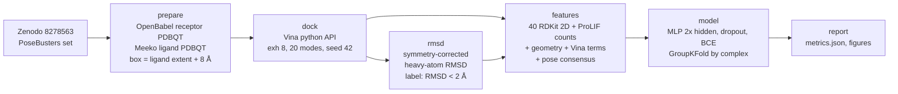

# dock-rescore

Machine-learning rescoring of AutoDock Vina docking poses on the PoseBusters Benchmark set.
Redock each ligand into its own receptor with Vina, then train a small PyTorch MLP on RDKit
ligand descriptors + ProLIF protein-ligand interaction counts + simple geometric features to
re-rank the 20 Vina poses so that the top-1 pose is near-native (heavy-atom RMSD < 2 Å) more
often than Vina's own ranking.

## Results

**Status: pilot only (5 complexes, CPU). The full 308-complex run is pending phase 2.**
The numbers below validate that the pipeline runs end to end; with 5 complexes they carry no
statistical meaning and must not be quoted as a benchmark result.


<!-- RESULTS_TABLE_START -->
Pilot: **5 complexes, 89 poses, 70 features**; GroupKFold n_folds=5 over 5 complexes. Near-native pose fraction 0.06; oracle top-1 (any pose < 2 Å) 0.80.

| metric | Vina rank | ML rescoring (out-of-fold) |
|---|---|---|
| top1_success | 0.800 | 0.800 |
| top1_hits | 4 | 4 |
| top3_near_native_fraction | 0.333 | 0.333 |
| top3_enrichment | 5.933 | 5.933 |
| roc_auc | 0.857 | 0.721 |

Wall-clock per complex (s, 8 Vina threads on CPU):

| complex | prepare | dock | rmsd | features | total |
|---|---|---|---|---|---|
| 7D5C_GV6 | 1.0 | 12.0 | 0.0 | 5.2 | 18.2 |
| 7N03_ZRP | 0.0 | 6.9 | 0.0 | 2.5 | 9.4 |
| 7P1M_4IU | 0.1 | 4.5 | 0.0 | 2.0 | 6.6 |
| 7TUO_KL9 | 0.1 | 5.8 | 0.0 | 3.6 | 9.5 |
| 7YZU_DO7 | 0.1 | 2.6 | 0.0 | 2.8 | 5.5 |

Mean 10 s per complex -> about 366 complexes per CPU-hour, i.e. roughly 1463-2195 complexes in 4-6 CPU-hours at this exhaustiveness (the 308-complex subset needs about 0.8 h). Caveat: the pilot was drawn from small-to-medium ligands (15-35 heavy atoms) and receptors < 8000 atoms, so this is an optimistic lower bound; larger ligands/boxes dock slower (Vina scales with box volume and torsions). Plan phase 2 with a 2-3x margin, and re-check timing on the first 30 complexes of the full run.

Software: vina 1.2.7, meeko 0.8.0, rdkit 2026.03.1, prolif 2.2.1, openbabel 3.2.1, torch 2.13.0, MDAnalysis 2.10.0, sklearn 1.9.0.
<!-- RESULTS_TABLE_END -->

Hardware: laptop with 16 logical CPU cores, 14 GB RAM, NVIDIA RTX 4060 Laptop 8 GB (GPU **not**
used in phase 1; Vina runs on 8 CPU threads, the MLP trains on CPU).

## What / why

Docking programs sample poses well but rank them imperfectly: for many complexes a
near-native pose is among the top-20 Vina modes but not at rank 1. A cheap learned rescoring
function that uses interaction-level information (H-bonds, pi-stacking, salt bridges, burial,
pose consensus) can close part of that gap. This repository is a compact, fully reproducible
version of that experiment on a public, well-curated set, with a strict complex-level split
so no receptor/ligand pair leaks between training and evaluation folds.

## Pipeline



Stages are `dockrescore` sub-commands (`src/dockrescore/cli.py`), each resume-safe and
parameterised by `config/config.yaml`.

### Features (per pose)

| block | content |
|---|---|
| ligand 2D | fixed list of 40 RDKit descriptors (`features.RDKIT_2D`) |
| interactions | ProLIF counts: HBDonor, HBAcceptor, Hydrophobic, PiStacking, Cationic, Anionic, CationPi, PiCation, XBDonor, VdWContact (+ total) |
| geometry | heavy-atom contacts < 4 Å, buried fraction (ligand atoms with a protein atom < 4.5 Å), min / mean-min distance, clashes < 2.5 Å, centroid offset from box centre, radius of gyration |
| docking | Vina total / inter / intra / torsional terms, rank, rank fraction, gap to best score, score per heavy atom |
| consensus | number of other poses within 2 Å, mean RMSD to other poses, RMSD to the rank-1 pose |

### Metrics

* **top-1 success rate**: fraction of complexes whose best-ranked pose (Vina score, or ML
  probability) has RMSD < 2 Å to the crystal ligand. The **oracle** is the fraction of
  complexes with *any* near-native pose among the 20 modes (upper bound for any rescoring).
* **top-3 enrichment**: near-native fraction among the three best-ranked poses divided by the
  near-native fraction over all poses.
* **ROC-AUC**: per-pose discrimination of near-native vs not, pooled over out-of-fold predictions.
* Cross-validation: `GroupKFold(5)` grouped by complex id (with < 5 complexes the fold count
  drops to the number of complexes, i.e. leave-one-complex-out).

## Reproduce

```bash
mamba env create -f environment.yml && conda activate dock   # rdkit, vina, meeko, openbabel, prolif, torch
bash run_all.sh                       # pilot: data/pilot_ids.txt (5 complexes)
IDS=data/ids_308.txt bash run_all.sh  # phase 2: full 308-complex run (CPU hours, see timings)
python -m pytest -q tests             # unit tests (RDKit only)
```

Individual stages: `python -m dockrescore {versions,select-pilot,prepare,dock,rmsd,features,train,report} --ids FILE`.
Outputs: `results/docking/<id>/` (git-ignored poses, scores, rmsd, per-complex features and
timings), `results/features.csv|.parquet`, `results/metrics.json`, `results/predictions.csv`,
`results/timings.csv`, `results/versions.json`, `results/report.md`, `figures/*.png`.

## Data provenance

* **PoseBusters Benchmark set** (428 complexes; 308-complex crystal-contact-free subset used in
  the journal paper), Zenodo record [8278563](https://zenodo.org/records/8278563), file
  `posebusters_paper_data.zip` (53.7 MB, MD5 `f004ac7c4e68317b5348497d2bb6bee6`, verified by
  `scripts/fetch_data.sh` against the checksum returned by the Zenodo API). Each complex folder
  holds `<id>_protein.pdb` (protein + cofactors, no solvent), `<id>_ligand.sdf` (crystal ligand),
  `<id>_ligands.sdf`, `<id>_ligand_start_conf.sdf`. The 308-id list comes from the PoseBusters
  GitHub repository (`posebusters_pdb_ccd_ids.txt`).
* `data/manifest.csv`: one row per complex (ids, ligand heavy atoms, SMILES, protein size, subset
  flag). `data/pilot_ids.txt`: the deterministic pilot selection (seed in `config/config.yaml`).
* Raw data lives in `data/raw/` (git-ignored); `bash scripts/fetch_data.sh` re-downloads it.
* PDBbind CASF-2016 was considered as a fallback but is not freely downloadable without
  registration, so it is not used.

## Limitations

* **Redocking, not cross-docking**: the receptor is the holo crystal structure of the very ligand
  being docked, which is much easier than docking into apo or cross-ligand structures.
* PoseBusters is a **pose-validity** benchmark set (recent, diverse, no training-set overlap with
  older models); it is not a scoring-function affinity benchmark. No binding affinity is predicted.
* Small model, small feature set, single docking program, one exhaustiveness setting; results
  are specific to Vina's pose ensemble.
* Receptor protonation by OpenBabel at pH 7.4 and ligand protonation "as given" in the SDF; no
  tautomer / protomer enumeration; cofactors and metals are kept as rigid receptor atoms.
* Phase 1 = 5-complex pilot on CPU; the numbers in `results/` are a pipeline check only.

## Citation

Buttenschoen M., Morris G. M., Deane C. M. *PoseBusters: AI-based docking methods fail to
generate physically valid poses or generalise to novel sequences.* Chem. Sci. 2024, 15, 3130-3139.
https://doi.org/10.1039/D3SC04185A (data: https://zenodo.org/records/8278563).

Eberhardt J., Santos-Martins D., Tillack A. F., Forli S. *AutoDock Vina 1.2.0.* J. Chem. Inf.
Model. 2021, 61, 3891-3898. Bouysset C., Fiorucci S. *ProLIF.* J. Cheminform. 2021, 13, 72.
Meeko: https://github.com/forlilab/Meeko. RDKit: https://www.rdkit.org.

License: MIT (c) 2026 Oleksandr Shovkoplias.
